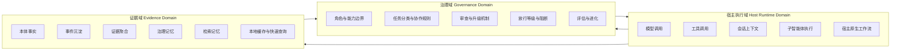
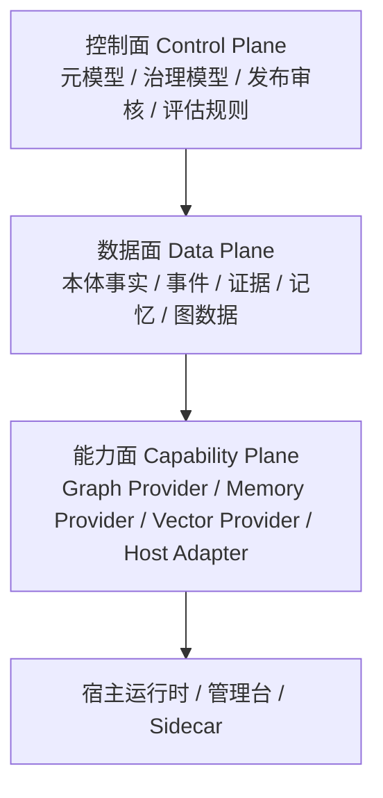
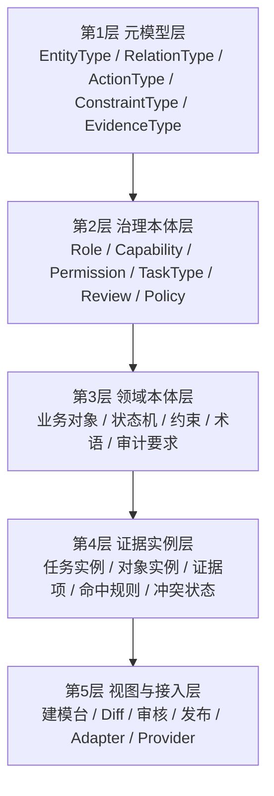
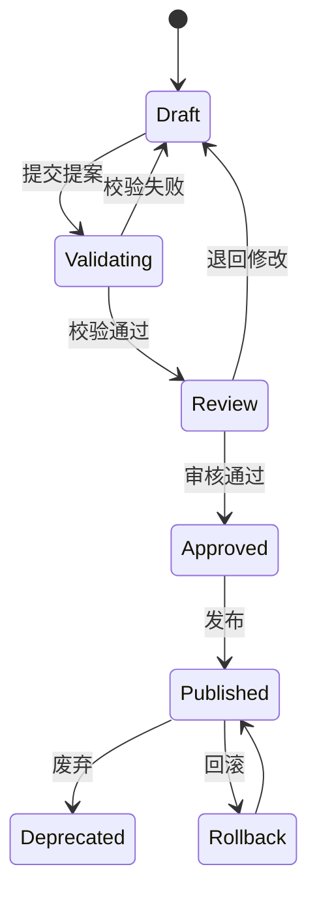
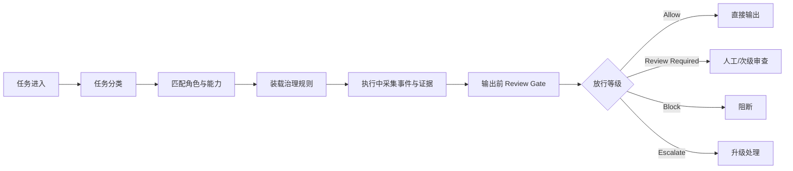
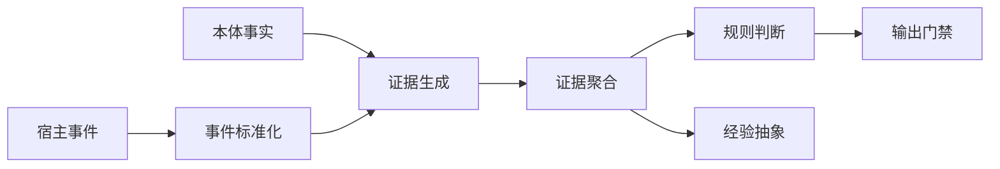
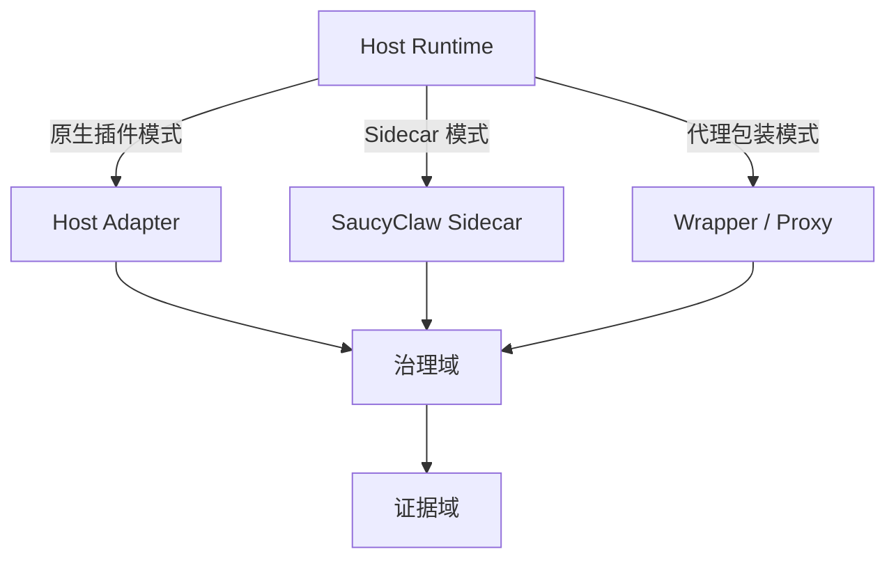
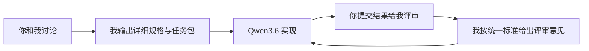

# SaucyClaw 详细设计说明书（vNext）

> 面向：项目负责人、架构设计模型、Qwen3.6 落地编码模型、后续评审模型
> 文档目标：统一设计语言、统一评审口径、统一模块分层、统一落地边界
> 文档状态：详细设计稿 / 可继续迭代

---

# 1. 文档说明

## 1.1 文档目的

本文档用于明确 SaucyClaw 的项目定位、架构分层、核心模型、模块边界、接口抽象、技术路线、统一代码评审标准与协作方式，使后续编码模型能够在受控边界内实现系统，而不是自由发挥。

## 1.2 设计原则

1. 愿景不收缩，但工程边界必须清楚。
2. SaucyClaw 不是纯提示词项目，也不是单一运行时插件集合。
3. SaucyClaw 是以本体、证据、治理为核心的可插入式多智能体 Harness。
4. 平台标准必须由 SaucyClaw 掌控。
5. 底层通用能力优先借成熟开源，不重复造轮子。
6. 所有实现必须围绕统一评审标准进行约束。

## 1.3 统一术语

| 术语 | 含义 |
|---|---|
| Host Runtime | OpenClaw、OpenHarness、Claude Code、Codex 等宿主运行时 |
| Governance | 角色边界、任务分类、权限、审查、升级、阻断、评估等治理能力 |
| Evidence | 可追溯、可验证、可引用、带时效的判断依据 |
| Ontology | 用于描述对象、关系、动作、约束、证据、策略的统一语义模型 |
| Adapter | SaucyClaw 对宿主系统的接入层 |
| Provider | SaucyClaw 对外部底座能力的统一抽象接口 |
| Sidecar | 宿主无原生集成能力时，SaucyClaw 以旁路服务方式提供能力 |
| Review Gate | 输出前的治理校验与评审关口 |

---

# 2. 项目定位

## 2.1 一句话定位

**SaucyClaw = 以本体与证据为核心、面向多智能体运行时的可进化治理 Harness 框架。**

## 2.2 目标定位

SaucyClaw 的目标不是替代 OpenClaw、OpenHarness 等宿主，而是为这些宿主提供一套统一的：

- 本体建模与对象化能力
- 证据沉淀与快速供给能力
- 多智能体治理与约束能力
- 统一评估与进化能力
- 标准化适配与实施能力

## 2.3 非目标

| 非目标 | 说明 |
|---|---|
| 不做通用大模型推理平台 | 模型推理、计费、推理调度不是当前核心 |
| 不做宿主运行时完整替代 | 不接管所有会话、工具、UI、模型调度 |
| 不做无边界的知识平台 | 本体平台服务于治理与决策，不追求泛知识产品 |
| 不让业务方自由定义平台语义 | 业务只能在受控元模型下提交模型 |
| 不全栈自研所有底座 | 图、记忆、检索、可视化等优先借成熟开源 |

---

# 3. 总体架构

## 3.1 三域架构图



## 3.2 架构角色说明

| 域 | 主要职责 | 是否自研主控 |
|---|---|---|
| 宿主执行域 | 模型、工具、会话、执行流程 | 否 |
| 治理域 | 治理规则、审查、评估、策略、输出门禁 | 是 |
| 证据域 | 本体事实、事件、证据、记忆、缓存 | 是（抽象主控） |

## 3.3 控制面 / 数据面 / 能力面



| 平面 | 说明 | 策略 |
|---|---|---|
| 控制面 | 语义标准、治理规则、版本、审核流 | 必须自研主控 |
| 数据面 | 事实、证据、事件、记忆数据 | 结构自控，存储可借力 |
| 能力面 | 图、检索、记忆、适配、执行支撑 | 接口统一，可插拔 |

---

# 4. 设计总原则

## 4.1 平台掌控原则

SaucyClaw 必须掌控：

- 元模型
- 本体 DSL / Schema
- 治理规则模型
- 证据模型
- 评审流程
- 发布与回滚机制
- 适配协议

## 4.2 借力成熟开源原则

优先借力但不被其定义语义：

- 图数据库
- 向量检索
- 检索记忆引擎
- 图可视化
- 事件总线
- 搜索 / rerank

## 4.3 证据优先原则

SaucyClaw 的判断基于：

**本体事实 + 运行证据 + 治理策略**

## 4.4 同一套代码评审原则

无论是我与你之间的设计评审，还是你交给 Qwen3.6 的编码落地评审，都必须使用同一套评审标准，不允许：

- 设计时一套标准，编码时另一套标准
- 对人类审稿宽松，对 AI 编码宽松
- 结构设计未定就直接让模型自由发挥

---

# 5. 本体平台设计

## 5.1 本体平台定位

本体平台不是给业务方自由绘图的工具，而是 SaucyClaw 与业务之间的**受控语义构建平台**。它必须能够：

- 统一对象定义
- 统一关系定义
- 统一动作与约束定义
- 统一证据类型与来源表达
- 统一版本、审核、回滚机制

## 5.2 本体五层结构图



## 5.3 五层详细说明

| 层 | 名称 | 作用 | 是否平台主控 |
|---|---|---|---|
| 1 | 元模型层 | 定义“如何定义本体” | 是 |
| 2 | 治理本体层 | 定义智能体治理语义 | 是 |
| 3 | 领域本体层 | 定义业务世界对象与规则 | 是，业务参与内容输入 |
| 4 | 证据实例层 | 表达运行中的真实事实与证据 | 是 |
| 5 | 视图与接入层 | 提供人机界面与系统接入 | 是 |

## 5.4 元模型建议对象

| 元概念 | 说明 |
|---|---|
| EntityType | 对象类型 |
| RelationType | 关系类型 |
| ActionType | 动作类型 |
| ConstraintType | 约束类型 |
| EvidenceType | 证据类型 |
| PolicyType | 策略类型 |
| RoleType | 角色类型 |
| CapabilityType | 能力类型 |
| ReviewType | 审查类型 |
| TimeScope | 时间与适用范围 |
| ConfidenceModel | 置信度模型 |

## 5.5 本体生命周期



## 5.6 业务参与边界

| 业务方可做 | 业务方不可做 |
|---|---|
| 提供领域对象候选 | 绕过平台定义平台级语义 |
| 提供规则来源与术语表 | 直接改治理本体 |
| 提供状态流与场景样例 | 直接发布未审核模型 |
| 提供审计要求与限制 | 定义不受控的约束表达方式 |

---

# 6. 治理域设计

## 6.1 治理域目标

治理域负责解决：

- 谁应该做什么
- 谁不能做什么
- 什么任务需要 review
- 什么结果可以直接放行
- 什么情况必须阻断或升级
- 如何评估规则是否退化

## 6.2 治理模型核心对象

| 对象 | 说明 |
|---|---|
| Role | 智能体角色 |
| Capability | 能力集 |
| Permission | 权限边界 |
| TaskType | 任务类型 |
| ReviewPolicy | 审查策略 |
| EscalationPolicy | 升级策略 |
| OutputGate | 输出门禁 |
| GovernanceRule | 治理规则 |
| EvaluationPolicy | 评估规则 |

## 6.3 任务治理流程图



## 6.4 放行等级

| 等级 | 含义 | 动作 |
|---|---|---|
| Allow | 满足规则和证据要求 | 允许输出 |
| Review Required | 允许继续但必须复核 | 加审查 |
| Block | 不满足最低约束 | 阻断输出 |
| Escalate | 风险过高或证据冲突严重 | 升级到更高角色 |

---

# 7. 证据域设计

## 7.1 证据域目标

证据域负责：

- 沉淀事实
- 汇聚运行事件
- 形成判断依据
- 向治理域提供快速可用证据
- 支撑可解释性与追溯性

## 7.2 本体事实与本体证据区分

| 类型 | 含义 | 示例 |
|---|---|---|
| 本体事实 | 被平台确认的稳定结构性定义 | 角色 developer 不能发布生产变更 |
| 本体证据 | 当前判断所依赖的运行依据 | 当前任务命中生产环境关键词且无审批号 |

## 7.3 证据模型

| 字段 | 含义 |
|---|---|
| evidence_id | 证据唯一标识 |
| evidence_type | 证据类型 |
| subject | 主体 |
| relation | 关系 |
| object | 客体 |
| assertion | 断言描述 |
| source_type | 来源类型 |
| source_ref | 来源引用 |
| timestamp | 采集时间 |
| freshness | 新鲜度 |
| confidence | 置信度 |
| verification_status | 校验状态 |
| applicable_scope | 适用范围 |
| contradicted_by | 冲突证据列表 |
| governance_version | 所属治理版本 |

## 7.4 证据流转图



## 7.5 证据使用规则

1. 所有关键结论必须可引用证据。
2. 证据必须能够回溯来源。
3. 证据必须带时间与适用范围。
4. 冲突证据必须显式标记。
5. 证据不足不得伪装成高置信度结论。

---

# 8. 记忆系统设计

## 8.1 总体原则

采用：

**治理记忆自控，检索记忆借力。**

## 8.2 记忆分类表

| 分类 | 说明 | 是否必须平台主控 |
|---|---|---|
| 治理记忆 | 规则命中、评审结论、失败模式、经验卡片 | 是 |
| 检索记忆 | 历史会话、文本片段、语义召回、相似案例 | 否，可借力 |

## 8.3 三段式内部抽象


## 8.4 治理记忆内容

| 类型 | 说明 |
|---|---|
| RuleHitRecord | 规则命中记录 |
| ReviewDecision | 审查决定 |
| FailurePattern | 失败模式 |
| ExperienceCard | 经验卡片 |
| CandidateRule | 候选规则 |
| EvidenceChain | 证据链 |
| OutputDecision | 输出放行决策 |

## 8.5 检索记忆 Provider 候选定位

| 候选方向 | 推荐用途 | 不建议承担 |
|---|---|---|
| 通用长期记忆服务 | 语义检索与召回 | 作为治理真相源 |
| 本地原文记忆方案 | 原始会话档案层 | 作为唯一长期治理记忆 |
| 图记忆方案 | 动态图证据与历史关系追踪 | 替代治理规则系统 |

---

# 9. 适配架构设计

## 9.1 接入模式图



## 9.2 三种接入模式说明

| 模式 | 适用场景 | 特点 |
|---|---|---|
| 原生插件模式 | 宿主有 hook / SDK | 集成深、体验最好 |
| Sidecar 模式 | 宿主不开放但允许本地配套服务 | 可独立演进，便于统一能力 |
| 代理包装模式 | CLI / Shell 型工具 | 易实施、可拦截输入输出 |

## 9.3 统一 Adapter / Provider 抽象

| 接口 | 职责 |
|---|---|
| HostAdapter | 宿主事件接入、上下文注入、输出拦截 |
| MemoryProvider | 检索记忆读写 |
| GraphProvider | 图存储与图查询 |
| VectorProvider | 向量召回 |
| EvidenceStoreProvider | 证据存储与检索 |
| PolicyEngineProvider | 规则计算与策略判断 |
| ReviewProvider | Review Gate 接口 |
| ScenarioRunnerProvider | 场景回放与验证 |

---

# 10. 评估与进化设计

## 10.1 评估对象

| 对象 | 说明 |
|---|---|
| Rule Effectiveness | 规则是否有效 |
| Task Effectiveness | 任务执行质量 |
| Agent Effectiveness | 角色表现 |
| Evidence Quality | 证据新鲜度、完整性、冲突率 |
| Adapter Quality | 宿主适配质量 |
| Scenario Validation | 回放与场景验证效果 |

## 10.2 进化四级模型

| 等级 | 名称 | 说明 |
|---|---|---|
| L1 | 观察式进化 | 监控退化、发现异常 |
| L2 | 建议式进化 | 产出规则候选、检查项建议 |
| L3 | 受控式进化 | 沙箱或影子模式验证新规则 |
| L4 | 授权式进化 | 自动微调非关键参数 |

## 10.3 进化闭环图


---

# 11. 技术选型原则

## 11.1 三类选型原则

| 类别 | 原则 |
|---|---|
| 控制面 | 自研主控 |
| 数据面 | 结构自控，存储借力 |
| 能力面 | 抽象统一，可替换 |

## 11.2 推荐选型方向表

| 层 | 推荐方向 | 说明 |
|---|---|---|
| 本体 DSL / Schema | 自研 DSL，参考通用 schema 建模理念 | 不被单一工具锁定 |
| 图存储 | PG 图扩展 / 图数据库可插拔 | 兼顾企业落地 |
| 记忆检索 | 通用长期记忆 / 本地档案层 / 向量召回 | 作为 Provider |
| 图证据 | 动态图记忆框架可借鉴 | 服务证据图，不反客为主 |
| 管理台 | 自研上层平台 | 体现实施价值 |

---

# 12. 模块划分与目录建议

## 12.1 顶层目录结构

```text
saucyclaw/
├── apps/
│   ├── admin-console/
│   └── scenario-studio/
├── core/
│   ├── meta-model/
│   ├── ontology/
│   ├── governance/
│   ├── evidence/
│   ├── events/
│   ├── evaluation/
│   └── review/
├── adapters/
│   ├── host/
│   │   ├── openclaw/
│   │   ├── openharness/
│   │   └── generic-cli/
│   └── providers/
│       ├── memory/
│       ├── graph/
│       ├── vector/
│       └── policy/
├── runtime/
│   ├── sidecar/
│   └── wrapper/
├── schemas/
│   ├── ontology/
│   ├── governance/
│   ├── evidence/
│   └── events/
├── docs/
│   ├── architecture/
│   ├── specs/
│   ├── reviews/
│   └── prompts/
└── tests/
    ├── unit/
    ├── integration/
    └── scenario/
```

## 12.2 模块职责表

| 模块 | 职责 |
|---|---|
| core/meta-model | 元模型定义与校验 |
| core/ontology | 本体结构与实例处理 |
| core/governance | 治理规则与决策逻辑 |
| core/evidence | 证据对象、聚合、冲突处理 |
| core/events | 事件标准化与日志模型 |
| core/evaluation | 评估指标与退化检测 |
| core/review | 输出门禁与复核机制 |
| adapters/host | 宿主适配 |
| adapters/providers | 外部能力接入 |
| runtime/sidecar | 旁路运行支撑 |
| apps/admin-console | 可视化建模与治理管理 |

---

# 13. 统一代码评审标准（核心）

> 这是你、我、Qwen3.6 共同使用的一套标准。

## 13.1 评审层级

| 层级 | 关注点 |
|---|---|
| L1 架构评审 | 分层是否正确、职责是否清楚 |
| L2 模块评审 | 接口抽象、依赖方向、扩展性 |
| L3 数据模型评审 | schema 是否统一、字段是否完整 |
| L4 实现评审 | 错误处理、命名、测试、性能 |
| L5 场景评审 | 是否满足关键用例和边界条件 |

## 13.2 统一评审清单

### A. 架构维度

| 检查项 | 说明 |
|---|---|
| 是否破坏三域分层 | 宿主域 / 治理域 / 证据域不能混写 |
| 是否破坏控制面与数据面边界 | 语义和存储不能耦合死 |
| 是否绕过 Adapter / Provider | 不允许直接写死外部实现 |
| 是否把业务语义写进平台内核 | 必须通过本体与 schema 进入 |

### B. 模块维度

| 检查项 | 说明 |
|---|---|
| 单模块职责是否单一 | 一个模块只做一类事 |
| 命名是否清晰 | 名称能体现角色 |
| 依赖方向是否正确 | core 不应倒依赖 apps |
| 可测试性是否足够 | 核心逻辑必须可单测 |

### C. 数据模型维度

| 检查项 | 说明 |
|---|---|
| schema 是否统一 | 不允许同义多套结构 |
| 字段是否缺关键元信息 | 时间、来源、版本、状态不能缺 |
| 是否支持扩展 | 预留扩展字段但不滥用 |
| 是否支持追溯 | 关键对象必须可回溯 |

### D. 实现维度

| 检查项 | 说明 |
|---|---|
| 是否有清晰错误处理 | 不能吞异常 |
| 是否有日志与审计点 | 关键路径必须留痕 |
| 是否有测试 | 核心模块缺测试不可过评审 |
| 是否考虑性能热路径 | 查询与判定热路径要明确 |

### E. 治理维度

| 检查项 | 说明 |
|---|---|
| 是否支持 Review Gate | 输出前必须有治理关口 |
| 是否可引用证据 | 裸结论不可接受 |
| 是否支持放行等级 | 不能只返回布尔值 |
| 是否考虑冲突证据 | 必须有冲突处理机制 |

## 13.3 评审结论分级

| 级别 | 含义 |
|---|---|
| Pass | 可进入下一阶段 |
| Pass with Notes | 可继续但需后续修正 |
| Needs Revision | 必须修改后再评审 |
| Reject | 方向错误，退回重做 |

---

# 14. 对 Qwen3.6 的实施约束

## 14.1 必须遵守

1. 不允许擅自改变三域架构。
2. 不允许把治理逻辑散落在宿主适配层。
3. 不允许把外部图/记忆产品直接当平台真相源。
4. 不允许绕过 evidence schema。
5. 不允许因为赶工而取消评审和测试。
6. 不允许未定义接口就直接绑定具体实现。

## 14.2 首轮开发优先级

| 优先级 | 模块 |
|---|---|
| P0 | core/meta-model |
| P0 | core/governance |
| P0 | core/evidence |
| P0 | core/events |
| P1 | adapters/host/openclaw |
| P1 | runtime/sidecar |
| P1 | schemas/* |
| P2 | adapters/providers/* |
| P2 | core/evaluation |
| P3 | admin-console |

---

# 15. 推荐协作工作模式

## 15.1 三方角色

| 角色 | 职责 |
|---|---|
| 你 | 方向、边界、优先级、最终决策 |
| 我 | 架构设计、规格说明、统一评审、风险识别 |
| Qwen3.6 | 受约束编码实现、补测试、提供可运行结果 |

## 15.2 闭环流程



## 15.3 每轮交付物

| 文档 | 用途 |
|---|---|
| 设计说明书 | 讲清为什么这么设计 |
| 模块规格说明 | 讲清接口和边界 |
| 开发任务包 | 讲清这一轮具体做什么 |
| 代码评审单 | 讲清做得怎么样 |

---

# 16. 结论

SaucyClaw 的核心不是“做一个更大的 agent 工具”，而是构建一套：

- 平台可掌控的本体与治理标准
- 面向多宿主的证据与记忆支撑能力
- 能被评审、被追溯、被进化的多智能体 Harness 框架

它的长期实施价值，在于把原本松散、口头化、依赖个人经验的多智能体协作，变成可建模、可验证、可审查、可沉淀的系统工程。
